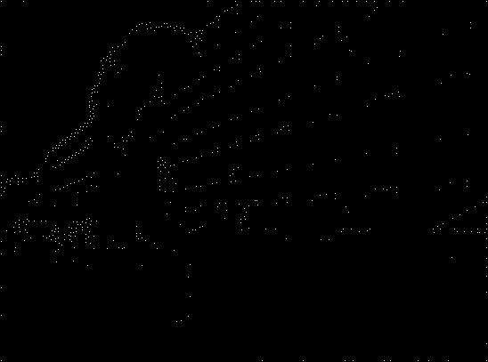
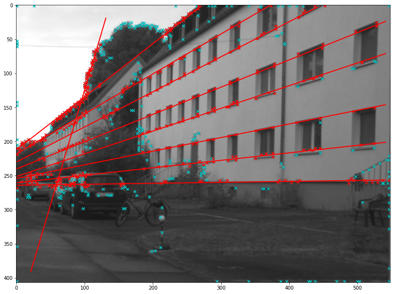
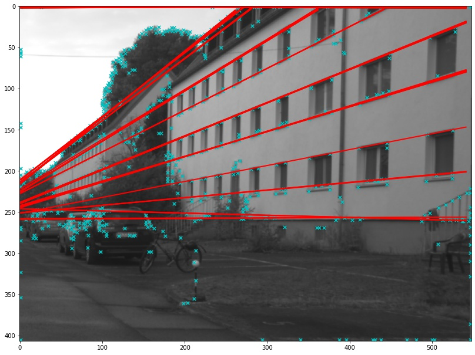

# Overview

The assignment solution can be found in thwe following 3 notebooks:
- [corner_detection.ipynb](./corner_detection.ipynb) - Problem 1
- [ransac.ipynb](./ransac.ipynb) - Problem 2
- [hough_transform.ipynb](./hough_transform.ipynb) - Problem 3

## Corner Detection Results: 

The corner detection image result can be found in location: `results/road_nms_2.jpg`



## RANSAC Results:

The RANSAC image result can be found in location: `results/ransac-fitting.png`



## Hough Transform Results:

The Hough Transform image result can be found in location: `results/road-hough-fitting.jpg`



# Dependencies

1. [Docker](https://www.docker.com/)

# Setup (in order to reproduce the code)

For ease of environment reproduction, we have created a [Dockerfile](./Dockerfile), which can be used to create a container with all the python packages pre-installed, by following the below mentioned steps: (_The following steps should be executed inside the directory where all the files have been extracted from the submitted zip file._)

1. How to build an image from dockerfile: 
```bash
docker build -f Dockerfile -t cv_hw_2 .
```

2. How to create a container from the above image: 
```bash
docker run --name cv_hw_2 -p 18888:8888 -itd cv_hw_2
```

Now, visit the url: [localhost:18888](http://localhost:18888) (password: `dgupta12_psood_asg2`)


# Only for development purposes

1. How to build an image from dockerfile:
```bash
docker build -f Dockerfile.dev -t cv_hw_2.dev .
```

2. For running development container:
```bash
docker run --name cv_hw_2.dev -p 19888:8888 -v ${pwd}:/assignment_2/ -itd cv_hw_2.dev
```

Now, visit the url: [localhost:19888](http://localhost:19888) (password: `dev`)